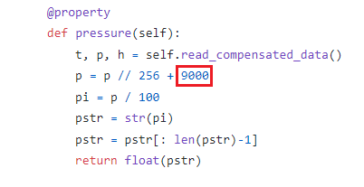

# Pico-Weather
Weather station for Raspberry Pi Pico.

Software for the Raspberry Pi Pico, makes use of:
* I) BME280 sensor
* II) Oled dispay 128x64 96 "

In the "lib" folder there is a modified version of the "bme280" library that allows you to read the single values in float format.

> In the previous image, the content of the red rectangle indicates the calibration of the sensor for 700 meters above sea level. Change this value if the sensor detects false pressure.

# Installation
* You need the above components.

* Put on the I2C0 bus (GPIO 0 and GPIO 1) an oled display and the bme280 sensor; 
on the I2C1 bus (GPIO2 and GPIO3) the other oled display.

* Clone the repository, remove README, LICENCE and Diagram. Copy it as is to your RPi Pico and launch the "main.py" file.

# Future update
* Maybe I'll add new features.
